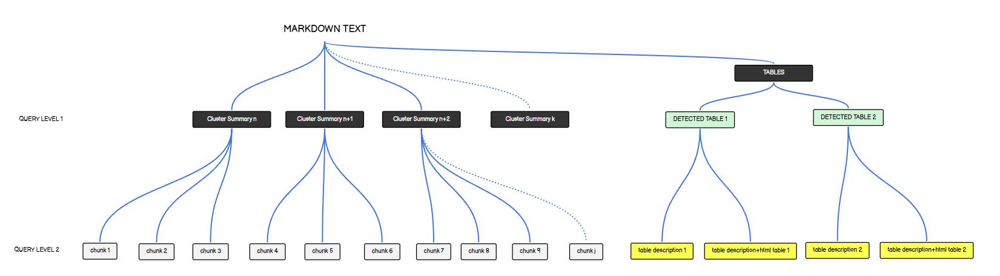

## Pipeline Flow

1. **Pre-processing**
   - Reads markdown and PDF documents
   - Splits text into sentences using spaCy (French language model)
   - Groups sentences into paragraphs
   - Generates embeddings using Gemma 2B model
   - Performs clustering using Gaussian Mixture Models to identify related content

2. **Data Transformations**
To deal with tables:
   - Extracts tables from PDF pages
   - Converts PDF pages to images
   - Encodes images for multimodal context
   - Generates table information with a VL Model
To deal with longer context:
   - Generates summaries for the clusters

3. **RAG Pipeline**
Diagram of the RAG query flow:



### Requirements

In order to run the code, you need to have the following files:
- `HF_TOKEN.txt` - Hugging Face API token
- `GROQ_KEY.txt` - GROQ API key
- A Llama Parse API key if your pdfs have not been converted to markdown yet.

Install the requirements:
```bash
pip install -r requirements.txt
```
And check that you comply with the other requirements file. Note: your kernel will crash if CUDA is not available.
